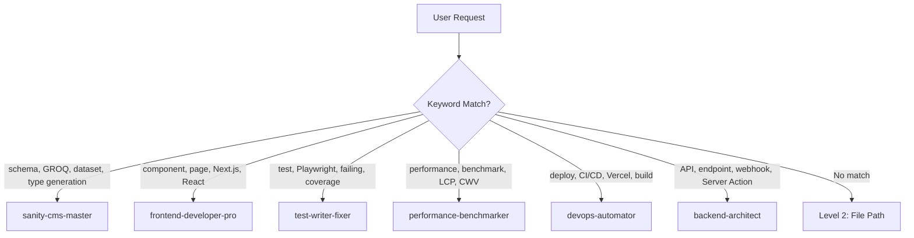
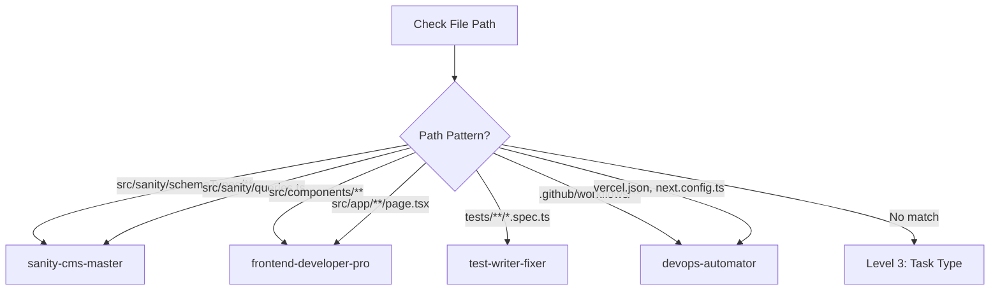
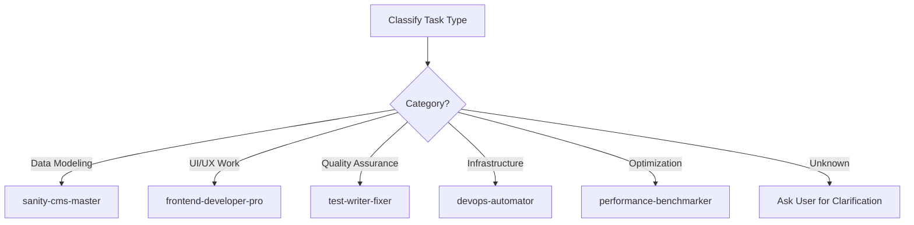

# Workflow Routing Guide
## Automatic Agent Selection for Local Business CMS

This guide provides decision trees and routing logic for automatically selecting the correct agent based on task type, keywords, and context.

---

## 🎯 Core Routing Logic

### Level 1: Keyword Detection (Instant Route)



### Level 2: File Path Analysis



### Level 3: Task Type Classification



---

## 🔍 Decision Trees by Task Category

### 1. Sanity CMS Tasks

```
START: Is this a Sanity CMS task?

├─ Schema Related?
│  ├─ YES → sanity-cms-master
│  │  Examples:
│  │  - "Add new field to service schema"
│  │  - "Create new document type"
│  │  - "Update schema validation"
│  │
│  └─ NO → Continue...

├─ Query Related?
│  ├─ YES → sanity-cms-master
│  │  Examples:
│  │  - "Optimize GROQ query"
│  │  - "Write query for homepage"
│  │  - "Fix query performance"
│  │
│  └─ NO → Continue...

├─ Dataset Related?
│  ├─ YES → sanity-cms-master
│  │  Examples:
│  │  - "Clone production dataset"
│  │  - "Deploy schema to all sites"
│  │  - "Migrate dataset"
│  │
│  └─ NO → Continue...

└─ Type Generation?
   ├─ YES → sanity-cms-master
   │  Examples:
   │  - "Fix TypeScript type errors from Sanity"
   │  - "Regenerate Sanity types"
   │
   └─ NO → Not a Sanity task
```

### 2. Frontend Development Tasks

```
START: Is this a frontend task?

├─ Component Work?
│  ├─ YES → frontend-developer-pro
│  │  Examples:
│  │  - "Build new hero section"
│  │  - "Fix navigation dropdown"
│  │  - "Create testimonial component"
│  │
│  └─ NO → Continue...

├─ Page/Route Work?
│  ├─ YES → frontend-developer-pro
│  │  Examples:
│  │  - "Create new page route"
│  │  - "Fix homepage rendering"
│  │  - "Implement dynamic routing"
│  │
│  └─ NO → Continue...

├─ Styling Work?
│  ├─ YES → frontend-developer-pro
│  │  Examples:
│  │  - "Fix mobile responsiveness"
│  │  - "Update Tailwind classes"
│  │  - "Implement dark mode"
│  │
│  └─ NO → Continue...

└─ Performance Issue?
   ├─ YES → Check if optimization or measurement
   │  ├─ Measurement → performance-benchmarker
   │  └─ Implementation → frontend-developer-pro
   │
   └─ NO → Not a frontend task
```

### 3. Testing Tasks

```
START: Is this a testing task?

├─ Write New Tests?
│  ├─ YES → test-writer-fixer
│  │  Examples:
│  │  - "Add tests for contact form"
│  │  - "Write E2E tests for checkout"
│  │  - "Create unit tests for utility"
│  │
│  └─ NO → Continue...

├─ Fix Failing Tests?
│  ├─ YES → test-writer-fixer
│  │  Examples:
│  │  - "SEO tests are failing"
│  │  - "Fix broken Playwright test"
│  │  - "Debug test failures"
│  │
│  └─ NO → Continue...

├─ Run Test Suite?
│  ├─ YES → test-writer-fixer
│  │  Examples:
│  │  - "Run all tests"
│  │  - "Verify test coverage"
│  │  - "Run SEO validation"
│  │
│  └─ NO → Continue...

└─ Test Coverage Analysis?
   ├─ YES → Decide complexity
   │  ├─ Simple → test-writer-fixer
   │  └─ Complex patterns → test-results-analyzer
   │
   └─ NO → Not a testing task
```

### 4. Performance Tasks

```
START: Is this a performance task?

├─ Measurement/Benchmarking?
│  ├─ YES → performance-benchmarker
│  │  Examples:
│  │  - "Benchmark homepage speed"
│  │  - "Measure Core Web Vitals"
│  │  - "Run Lighthouse audit"
│  │
│  └─ NO → Continue...

├─ Optimization Implementation?
│  ├─ YES → Check what needs optimization
│  │  ├─ Frontend code → frontend-developer-pro
│  │  ├─ GROQ queries → sanity-cms-master
│  │  ├─ Backend/API → backend-architect
│  │  └─ Build process → devops-automator
│  │
│  └─ NO → Continue...

└─ Performance Issue Diagnosis?
   ├─ YES → performance-benchmarker (to identify)
   │        Then hand off to specialist
   │
   └─ NO → Not a performance task
```

### 5. Deployment/Infrastructure Tasks

```
START: Is this a deployment/infrastructure task?

├─ CI/CD Related?
│  ├─ YES → devops-automator
│  │  Examples:
│  │  - "Fix GitHub Actions"
│  │  - "Update CI pipeline"
│  │  - "Add pre-commit hooks"
│  │
│  └─ NO → Continue...

├─ Vercel/Deployment?
│  ├─ YES → devops-automator
│  │  Examples:
│  │  - "Deploy to production"
│  │  - "Configure Vercel settings"
│  │  - "Set up preview deployments"
│  │
│  └─ NO → Continue...

├─ Multi-Site Deployment?
│  ├─ YES → devops-automator
│  │  Examples:
│  │  - "Deploy to all 100 sites"
│  │  - "Schema deployment automation"
│  │  - "Coordinate multi-site rollout"
│  │
│  └─ NO → Continue...

└─ Build Configuration?
   ├─ YES → devops-automator
   │  Examples:
   │  - "Optimize build time"
   │  - "Fix build errors"
   │  - "Update next.config.ts"
   │
   └─ NO → Not an infrastructure task
```

---

## 🎨 Keyword Dictionary

### Sanity CMS Keywords
```
Primary: schema, GROQ, dataset, sanity, type generation
Secondary: document, field, reference, singleton, portable text
Actions: clone, migrate, deploy schema, regenerate types
Files: schemaTypes/**, queries.ts, loaders.ts
```

### Frontend Keywords
```
Primary: component, page, route, Next.js, React, UI
Secondary: responsive, mobile, styling, Tailwind, layout
Actions: build, create, fix, implement, render
Files: components/**, app/**/page.tsx, layout.tsx
```

### Testing Keywords
```
Primary: test, Playwright, spec, coverage, failing
Secondary: E2E, unit, integration, assertion, mock
Actions: write tests, run tests, fix tests, validate
Files: tests/**, *.spec.ts, *.test.ts
```

### Performance Keywords
```
Primary: performance, benchmark, LCP, CWV, Core Web Vitals
Secondary: optimization, slow, bundle, lighthouse, FID, CLS
Actions: measure, profile, optimize, audit, analyze
Metrics: LCP, FID, CLS, TTI, FCP, TTFB
```

### DevOps Keywords
```
Primary: deploy, CI/CD, Vercel, build, pipeline
Secondary: GitHub Actions, workflow, automation, production
Actions: deploy, configure, automate, monitor, scale
Files: .github/workflows/**, vercel.json, next.config.ts
```

### Backend Keywords
```
Primary: API, endpoint, webhook, Server Action
Secondary: database, query, integration, middleware
Actions: design, implement, optimize, integrate
Files: app/api/**, actions/**, middleware.ts
```

---

## 📊 Multi-Agent Workflow Patterns

### Pattern A: Full Feature Implementation
```
User: "Add a blog feature to the CMS"

AUTO-ROUTE:
1. sanity-cms-master
   - Create blog post schema
   - Write GROQ queries for blog listing/detail

2. frontend-developer-pro
   - Build blog list component
   - Create blog post page
   - Implement pagination

3. test-writer-fixer
   - Write E2E tests for blog
   - Add SEO validation tests

4. performance-benchmarker
   - Benchmark blog pages
   - Verify Core Web Vitals

5. devops-automator
   - Deploy schema to all datasets
   - Deploy frontend changes
```

### Pattern B: Bug Fix Workflow
```
User: "Services page is showing wrong data"

AUTO-ROUTE:
1. test-writer-fixer
   - Reproduce bug with test

2. Diagnose issue location:
   ├─ GROQ query wrong? → sanity-cms-master
   ├─ Component rendering wrong? → frontend-developer-pro
   └─ Data transformation wrong? → backend-architect

3. test-writer-fixer
   - Verify fix with tests
   - Update test suite

4. devops-automator
   - Deploy fix to production
```

### Pattern C: Performance Investigation
```
User: "Homepage is loading slowly"

AUTO-ROUTE:
1. performance-benchmarker
   - Run full performance audit
   - Identify bottlenecks

2. Hand off to specialist based on findings:
   ├─ Slow GROQ queries → sanity-cms-master
   ├─ Large bundle size → frontend-developer-pro
   ├─ Slow API calls → backend-architect
   └─ Build inefficiency → devops-automator

3. performance-benchmarker
   - Re-benchmark after fixes
   - Verify improvement
```

### Pattern D: Multi-Site Launch
```
User: "Launch new business site for ABC Plumbing"

AUTO-ROUTE:
1. sanity-cms-master
   - Clone production dataset
   - Verify content isolation

2. devops-automator
   - Configure Vercel project
   - Set environment variables
   - Deploy site

3. test-writer-fixer
   - Run full test suite on new site
   - Validate SEO

4. performance-benchmarker
   - Audit performance
   - Verify meets targets
```

---

## 🚦 Routing Confidence Levels

### High Confidence (Auto-Route Immediately)
- ✅ Exact keyword match
- ✅ File path in agent's domain
- ✅ Task type clearly matches agent specialty

### Medium Confidence (Auto-Route with Note)
- ⚠️ Keywords suggest agent but task is complex
- ⚠️ Multiple agents might be needed
- ⚠️ Hand-off will likely be required

### Low Confidence (Ask User First)
- ❌ Ambiguous request
- ❌ Multiple valid agents possible
- ❌ Unclear task category

**Example Low Confidence**:
```
User: "Make the site better"

Response: "I'd be happy to help improve the site! To route
this to the right specialist, could you specify:
- Performance improvements? (performance-benchmarker)
- UI/design enhancements? (frontend-developer-pro)
- SEO optimization? (sanity-cms-master for content)
- Code quality? (test-writer-fixer for coverage)
```

---

## 🎯 Quick Routing Examples

| User Request | Auto-Route To | Confidence | Reasoning |
|--------------|---------------|------------|-----------|
| "Add urgency field to service schema" | sanity-cms-master | HIGH | Schema keyword + schemaTypes path |
| "Fix mobile menu not closing" | frontend-developer-pro | HIGH | Component + UI keywords |
| "SEO tests failing after deploy" | test-writer-fixer | HIGH | Tests + failing keywords |
| "Homepage LCP is 4.2 seconds" | performance-benchmarker | HIGH | Performance metric |
| "Deploy to all sites" | devops-automator | HIGH | Deploy + multi-site keywords |
| "Optimize the services query" | sanity-cms-master | HIGH | GROQ query keyword |
| "Create API for lead capture" | backend-architect | HIGH | API keyword |
| "Site is slow" | performance-benchmarker | MEDIUM | Needs diagnosis first |
| "Improve UX" | ASK USER | LOW | Too ambiguous |

---

## 🔄 Agent Hand-Off Protocol

When an agent determines another agent is needed:

**Template**:
```
[Current Agent]: "I've completed [task]. Based on the next
requirement [specific need], I recommend handing off to
[next agent] because [reasoning]."

Example:
sanity-cms-master: "I've created the blog post schema and
GROQ queries. To build the UI components that render this
data, I recommend handing off to frontend-developer-pro."
```

---

## 📈 Routing Effectiveness Metrics

Track these to improve routing:
- **Correct first-agent selection**: Target >90%
- **Average hand-offs per task**: Target <2
- **User clarification requests**: Target <10%
- **Task completion without re-routing**: Target >85%

---

**Last Updated**: October 24, 2025
**Version**: 1.0
**Purpose**: Enable automatic agent selection for efficient task routing
